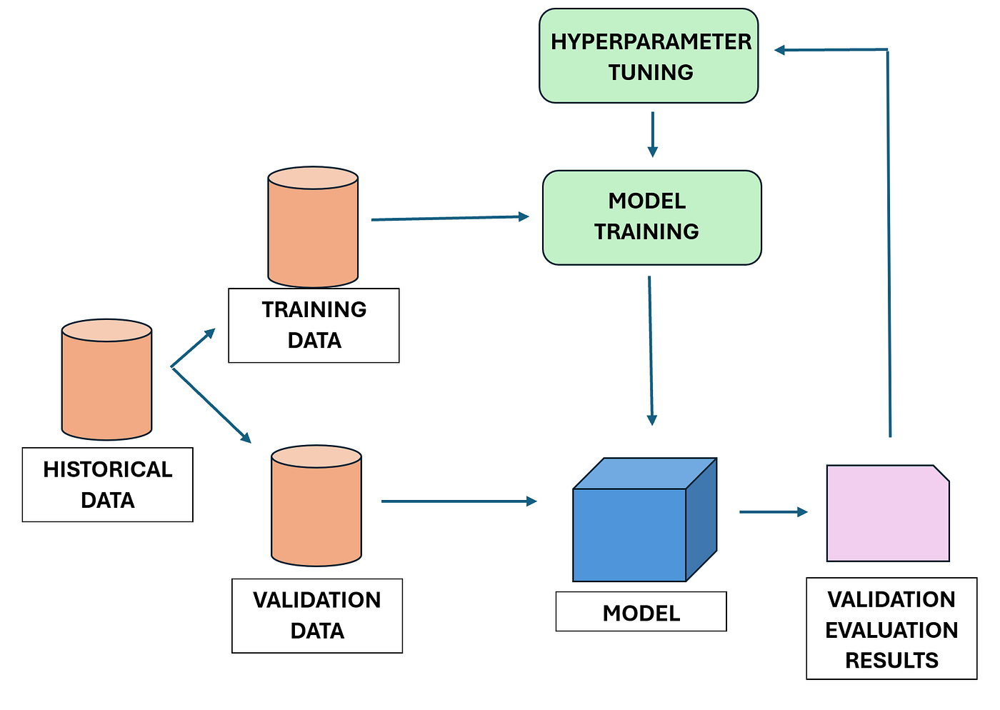
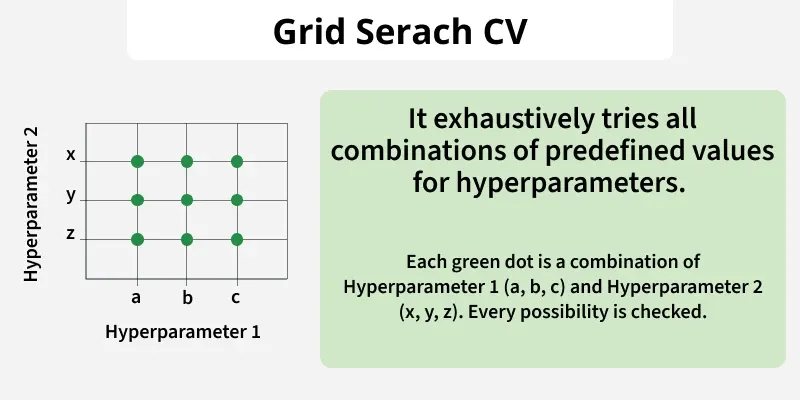
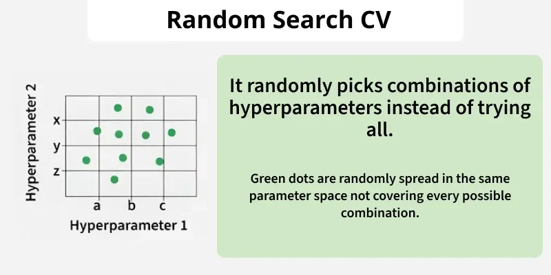
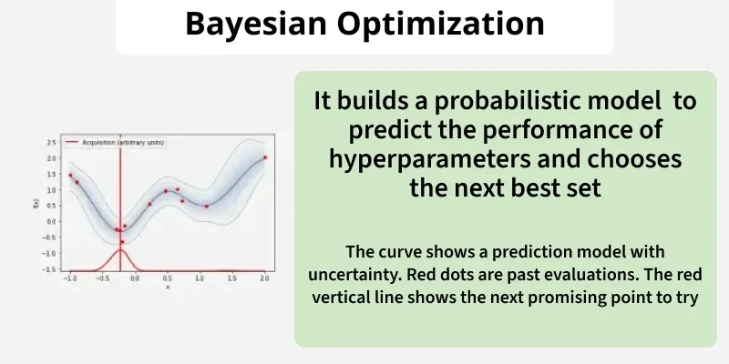

**Hyperparameters** are the "settings" of a machine learning algorithm. Unlike model parameters, which are learned automatically during training, hyperparameters must be defined beforehand. Proper tuning is the difference between a mediocre model and a state-of-the-art solution.

The following image illustrates the systematic path taken to identify the best model configuration, from defining the search space to final model training.

---

## Search Techniques

### 1. GridSearchCV (Exhaustive Search)
A methodical approach that evaluates every possible combination within a predefined grid.
* **Best for:** Small datasets and limited parameter sets.
* **Key Characteristic:** Guaranteed to find the best combination within the grid, but very slow.

### 2. RandomizedSearchCV (Stochastic Search)
Selects a fixed number of random combinations from the total search space.
* **Best for:** High-dimensional spaces where many parameters might not significantly impact the outcome.
* **Key Characteristic:** Significantly faster than Grid Search and often finds an optimal solution in fewer iterations.

### 3. Bayesian Optimization (Informed Search)
A sophisticated strategy that uses mathematical probability to find the best parameters.
* **Key Characteristic:** It keeps track of past evaluation results and uses them to "guess" which combination to try next, focusing only on the most promising areas of the search space.

---

## Why It Matters

* **Improved Generalization:** Prevents the model from "memorizing" the training data (overfitting).
* **Resource Efficiency:** Informed search methods save time and cloud computing costs.
* **Model Robustness:** Ensures the model remains stable when encountering new, unseen data.

---

## Credits & References
This documentation was inspired by and adapted from the **GeeksforGeeks** tutorial on [Hyperparameter Tuning](https://www.geeksforgeeks.org/hyperparameter-tuning/).

---

*Last Updated: January 2026*